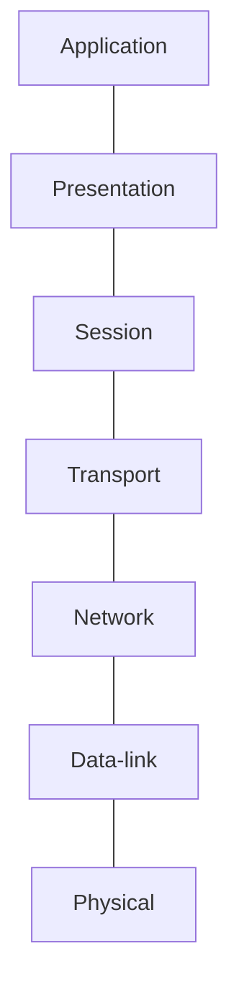

# Networking Topics

=======
* [OSI model](#osi-model)
* TCP/IP Model
* Host-Host communication / MAC Address + IP address
* Layer-3 (IP address basics)
* Host + Network = IP addr, why subnet mask is needed?
* Default Gateway
* IP packet
* headers, ... size..?
* ICMP
* TraceRoute
* ARP
* Routing Example - TODO
* UDP
	* Multiplexing and demultiplexing
	* UDP Datagram
	* Pros & cons
* TCP
	* Multiplexing and demultiplexing
	* TCP Segment
* Flow Control
* Congestion Control
* NAT: How WAN sees your internal devices?
* MSS/MTU and Path MTU
* Nagle's algorithm
* Delayed Acknowledgement
* Layer 3 (Network layer protocols)
	* IP
	* IPSec: https://www.cloudflare.com/en-gb/learning/network-layer/what-is-ipsec/
	* ICMP
	* IGMP
	* GRE
* What is tunneling?: https://www.cloudflare.com/en-gb/learning/network-layer/what-is-tunneling/
* TLS handshake 
	* It happends after TCP handshake: https://www.cloudflare.com/en-gb/learning/ssl/what-happens-in-a-tls-handshake/
	* Deep packet anaylsis wireshark: https://www.youtube.com/watch?v=25_ftpJ-2ME&ab_channel=DavidBombal
	* This will cover PKI
* Why is it dangerous to host server on 0.0.0.0 ipv4 address or ::/0 ipv6 addr?

# OSI model
* Standard model for communication among different devices of different versions, operation sys etc.
* 7 Layers 
	* Application layer: 
		* initiate communication
		* (HTTP/FTP/SMTP/DHCP)
	* Presentation layer: 
		* prepare data in a correct format so, that the server/client can understand.
		* For example if client is sending JSON data to server, then this layer will serialize client JSON to flat byte strings.
	* Session layer:
		* synchronizes data transfer with checkpoints: https://www.cloudflare.com/en-gb/learning/ddos/glossary/open-systems-interconnection-model-osi/
	* Transport layer:
		* TCP/UDP
	
=======

